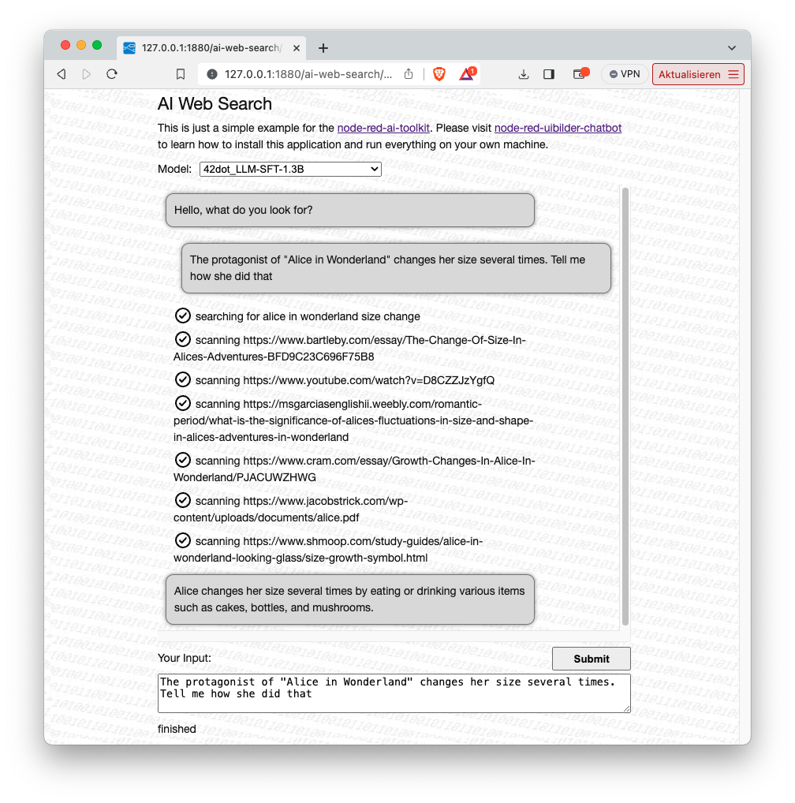
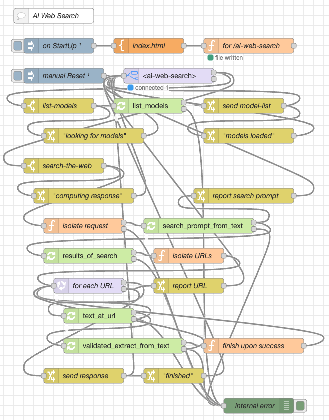

# node-red-ai-web-search #

a simple AI LLM Web Search Summarizer based on the Node-RED-AI-Toolkit

This repository contains a Node-RED flow which implements an AI-assisted web search. It is primarily intended to serve as an example for the Node-RED AI Toolkit, but may also be used on its own.

"AI-assisted" means:

- after specifying what you are looking for, the AI constructs an efficient prompt for a web search engine
- after receiving a list of documents which might contain the requested information, these documents are downloaded one after the other and the AI tries to extract the information you need

The flow stops after the first successful information retrieval, i.e. it does not (yet) combine the contents of several documents.

## License ##

[MIT License](LICENSE.md)
